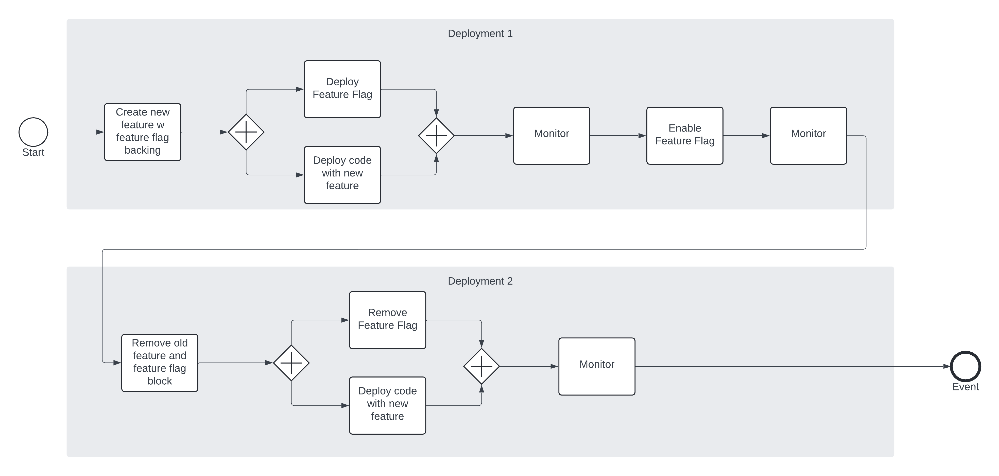

# Flaggy!

Flaggy is an API that supports the most basic feature flag use case (On or Off).

## What is a Feature flag?
Feature flags or feature toggles are [typically] short-lived On/Off flags that can be used by an 
application to determine if a request should serve an old feature or a new feature based on the 
state of the toggle.  For back-end systems "Feature" is synonymous with "Behavior".  In this case
we're referring to a code block we want to use to accomplish a task.

Used appropriately, feature flags allow us to ~~test~~ experiment in production with manageable risk.  Many of our clients
do not grant access to production or do not allow us to run tests in production.  We can deploy and test all
the way through pre-prod then we're left with a fingers crossed deployment to production, hoping that our 
code still performs.

Observability lies at the heart of effective feature flag strategy where a new feature is rolled out all the way 
to prod, observed, and then either left on or turned back off.  

> 
"If you can't measure it, you can't manage it"
 - Peter Drucker

## Feature Flag Types
Some organizations may have service level objectives (SLOs) or agreements (SLAs) that when not met can result in expensive penalties.
One client reported that on average a code-based error in production can result in upwards of 6,000.00/minute cost.

To minimize this, many 3rd party feature flag services offer more than just On/Off.

### Percentage Based
Percentage based Feature Flags allow us to "trickle" traffic to the new feature.  We could start with 5% of all traffic 
using the new feature then progressively increase the percentage up to 100%.  If at any time our observations are trending
south, we can turn the feature flag off and go back to our development cycles armed with live data to help us determine
root cause.

### Segmentation Based
Some clients may choose to provide a new feature to a select group of customers.  They may serve as our guinea pigs
while we're developing the new feature.  We can then get both observability based data as well as human data indicating
how well or poorly our new feature is functioning.  Note that segmentation based flags are also a part of A/B testing as well 
as Personalization.  You'll find these types of rules used quite often in front end applications.

#### Example - Geolocation based rule
Customers from the West Coast see a banner of La Jolla Beach.  Customers from the East Coast see a banner of Boynton Beach

## Purpose
Feature flag deployments are a lower risk alternative to production deployments where blue/green deployments aren't supported/available or 
don't satisfy our Time To Market for the purpose of experimentation.

Keep in mind when using feature flags that service level objectives (SLO) still come into play. For mission critical applications, feature flags may not be ideal.
In this case, the alternative is blue/green deployment.

## A Real World Example
We've been tasked with improving the query performance of a query used to return our account along with its balance in 2 seconds.  We want to conduct an experiment
and use an alternative query.  In non-production, it's faster but we don't have the same amount of data as we
do in Production.

## Usage
Build flaggy, tag docker image to flaggy:latest and compose flaggy up to docker

    make start

Create the sample feature flag "my-feature" and deploy it to flaggy as a disabled feature flag

    make create-flag

Simulate post-deployment scenario where we want to turn on the new feature.

    make enable-flag

Simulate post-deploymnet scenario where we turned the flag on, found out our new feature isn't up to snuff yet and need to turn it back off.

    make disable-flag

